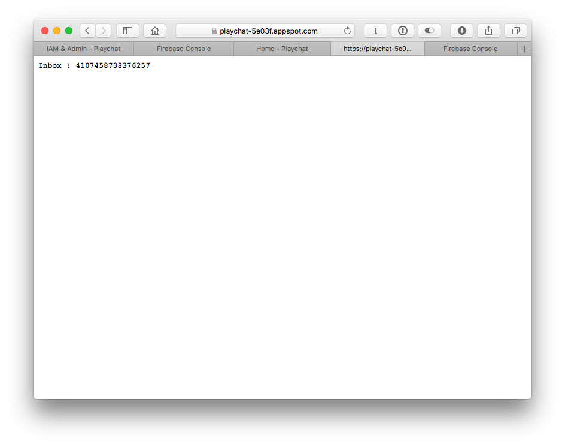
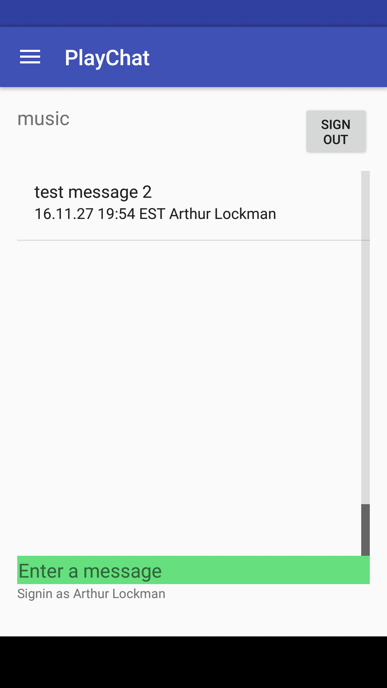
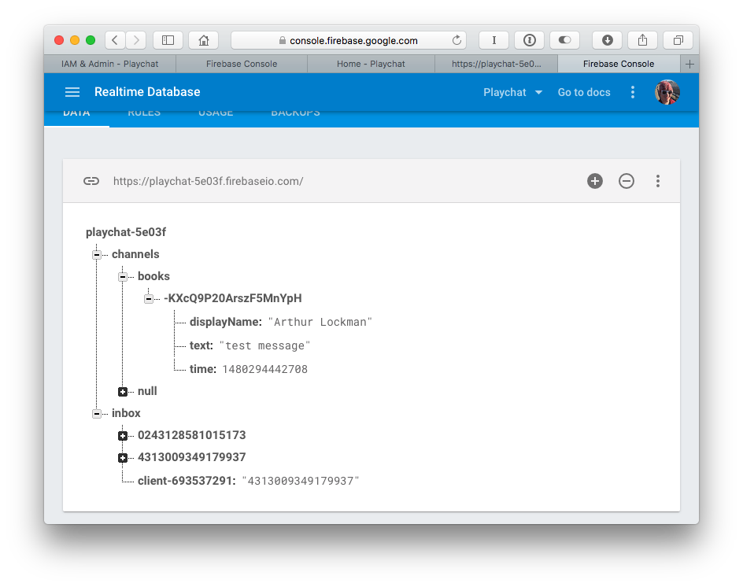
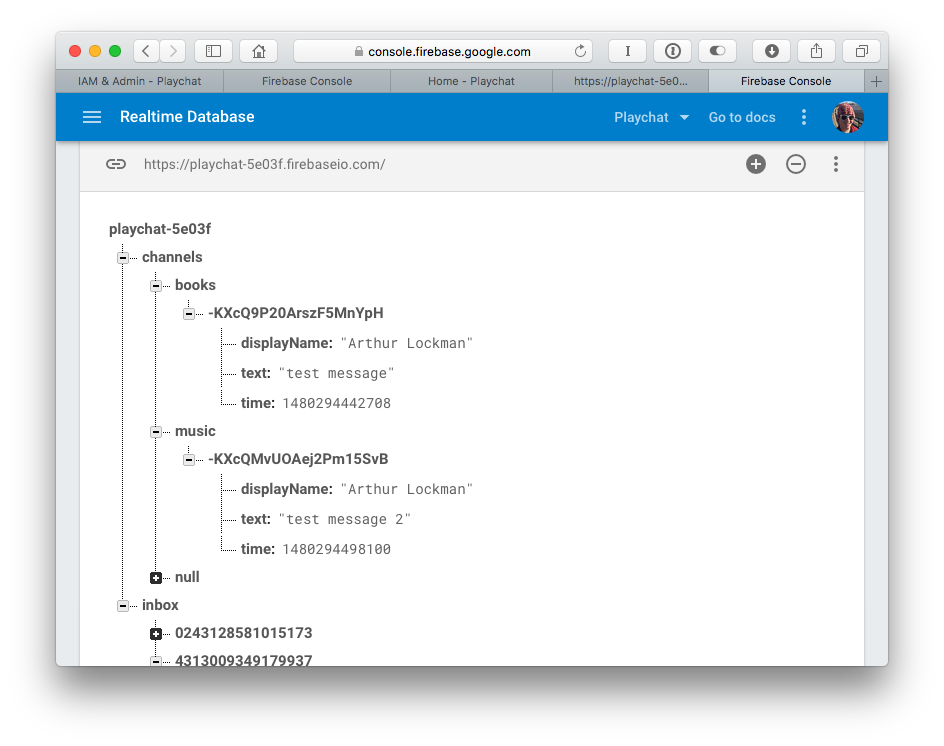
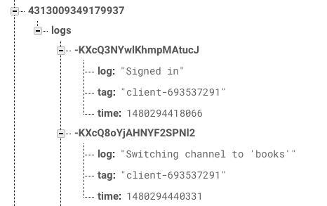

# Project 3 - Arthur Lockman

The goal of this project was to set up a sample Android app that uses Firebase and Google App Engine as a backend, and to experiment with backend design using this app.

## 3: Set up the PlayChat app using Firebase and AppEngine

### Figure 1a (10 points): Screenshot of app successfully deployed to AppEngine




### Figure 1b (10 points): Screenshot of android app running on device

| Books channel             | Music channel               |
| ------------------------- | --------------------------- |
|  |  |

### Figure 1c: Firebase DB with tasks performed

The tasks I performed were:

1. Send message titled "test message" in channel #books
2. Send message titled "test message 2" in channel #music

| Firebase books channel data | Firebase music channel data |
| --------------------------- | --------------------------- |
|    |  |

**Firebase Logs data**



### 3.1.3  (15 points): Explain the data stored in the Firebase database

There are two types of data stored in the Firebase database: messages and log information. The messages are stored under the *channels* data in the DB. Those can be seen in the first two screenshots in Figure 1c above. 

In the client, I sent messages on both the music and books channel to generate multiple different types of data (Figure 1b and 1c). Each message sent by my client generated a new element in its respective channel data that contained the name of the sending user, the text of the message, and the time that the message was sent. 

The log data seen in the third screenshot above shows the logs generated by the client and saved to the server. Whenever the client performs an action like changing channels or logging in that event is sent to and logged in the Firebase database. A separate log inbox is created for each client to separate their data form each other.

### 3.2.1 (10 points): Explain how the servlets are saving event logs

Currently the servlets are not saving event logs on a disk. Event logs are generated by the client and pushed into Firebase. The servelet is listening to firebase for additional logs to appear, and is storing those that it finds in memory. A snippet of the code is included below for reference:

```java
public void onChildAdded(DataSnapshot snapshot, String prevKey) {
  if (snapshot.exists()) {
    LogEntry entry = snapshot.getValue(LogEntry.class);
    logs.add(entry);
  }
}
```

This code is the primary "save" method that is taking place on the server. It is configured when the servelet starts up, in the `initLogger()` method. The method is added as part of the event listener attached to the Firebase database for a specific inbox entity corresponding to a client. The overall listener is configured to listen for any change on a Firebase data element named `/[client inbox ID]/logs`. This snippet specifically is listening for a new sub-element to be added to this data.

When a new element is added, this code first checks to see if the data snapshot that it has been notified about actually exists. If it does, it gets the value of the new log entry and creates a `LogEntry` object to represent that information. Finally, it adds that `LogEntry` to a list of logs that is stored in memory on the servelet. 

This created list of logs is never saved anywhere except in the servelet memory. This means that if the servelet is restarted the logs that have been captured from the database are lost. 

### 3.2.2 (20 points): Explain the steps necessary to allow servlets to write to Google Cloud Storage

The steps for allowing servelets to read and write data from Google Cloud Storage are as follows:

1. Create a bucket and set permissions to allow your app to read and write to it. This is done by default when you set up an AppEngine application, like the one created for this project. 
2. Download and install the client library into the project. This is done through a Maven import statment in the `pom.xml` file that defines the project dependencies.
3. In your client project, you need to authorize yourself with the google cloud using the `gcloud auth` command in the command line.

Once you have authenticated and installed the client library, your application is set up to use GCS.

### 3.2.3 (20 points): Refactor the code to write to GCS

The methods created to allow writing to GCS can be found in `MessageProcessorServlet.java`, or in the snippet included below.

```java
/**
   * This method downloads the log file from GCS, appends data to it, and re-writes it back to the server. 
   * This ensures that the log information is not destroyed each time the servelet starts up, and 
   * is not overwritten.
   * @param newLine The new log entry to add to the log file.
   */
private void appendToGCSLogFile(LogEntry newLine) {
  String fileContents = readFileFromGCS(); // Read GCS log file
  fileContents += new Date(newLine.getTimeLong()).toString() + "(id=" + newLine.getTag()
    + ")" +  " : " + newLine.getLog() + "\n"; //Append to existing data
  writeFileToGCS(fileContents); //Write new file to GCS
}

/**
   * This method writes a file to GCS with given contents. It automatically gets
   * the proper filename for this servelet from the getFileName() method.
   * Adapted from https://github.com/GoogleCloudPlatform/appengine-gcs-client/blob/master/java/example/src/main/java/com/google/appengine/demos/GcsExampleServlet.java
   * @param fileContents The contents to write to the file.
   */
private void writeFileToGCS(String fileContents) {
  GcsFileOptions instance = GcsFileOptions.getDefaultInstance(); // get default instance of GCS
  GcsFilename fileName = getFileName(); // Get GCS filename to write to
  GcsOutputChannel outputChannel; //Create an output channel
  try {
    outputChannel = gcsService.createOrReplace(fileName, instance); //Get an output channel for the desired filename
    InputStream is = new ByteArrayInputStream(fileContents.getBytes("UTF-8"));
    copy(is, Channels.newOutputStream(outputChannel)); //Copy string to the file output
  } catch (IOException e) {

  }
}

/**
   * This method reads a file to GCS with given contents. It automatically gets
   * the proper filename for this servelet from the getFileName() method.
   * Adapted from https://github.com/GoogleCloudPlatform/appengine-gcs-client/blob/master/java/example/src/main/java/com/google/appengine/demos/GcsExampleServlet.java
   */
private String readFileFromGCS() {
  GcsInputChannel readChannel = gcsService.openPrefetchingReadChannel(getFileName(), 0, BUFFER_SIZE); // Create a channel to read from
  StringWriter writer = new StringWriter();
  String fileContents = "";
  try {
    IOUtils.copy(Channels.newInputStream(readChannel), writer, "UTF-8"); //Copy contents of GCS file to string
    fileContents = writer.toString();
  } catch (IOException e) {

  }
  return fileContents; //Return read string
}

/**
   * Get a handle to a specific file in GCS using the inbox ID. Each
   * device inbox will have its own log file.
   */
private GcsFilename getFileName() {
  return new GcsFilename("playchat-5e03f.appspot.com", inbox + ".log");
}

/**
   * Transfer the data from the inputStream to the outputStream. Then close both streams.
   */
private void copy(InputStream input, OutputStream output) throws IOException {
  try {
    byte[] buffer = new byte[BUFFER_SIZE];
    int bytesRead = input.read(buffer);
    while (bytesRead != -1) {
      output.write(buffer, 0, bytesRead);
      bytesRead = input.read(buffer);
    }
  } finally {
    input.close();
    output.close();
  }
}
```

Additionally, I modified the method that collects logs from Firebase to write these logs to GCS as well:

```java
public void onChildAdded(DataSnapshot snapshot, String prevKey) {
  if (snapshot.exists()) {
    LogEntry entry = snapshot.getValue(LogEntry.class);
    logs.add(entry);
    appendToGCSLogFile(entry); //Save log information to Google Cloud Storage
  }
}
```

### 3.3.1 (10 points): Document how the client-side workload is being distributed to servlets

The client side workload is being distributed to servlets using Firebase as intermediate layer. First, when the client has connected to Firebase successfully it generates an inbox ID which will be used to identify itself to the servlet and the database event logger. When the client logs in and authenticates with the Google authentication API, the client calls the `requestLogger()` method. This method configures the new inbox channel in the Firebase database, and then adds a new child value to the `requestLogger` child element in the database with its inbox ID as a value. 

```java
firebase.child(REQLOG).push().setValue(inbox);
```

On the servlet side, at servlet manager creation a listener is set up on the Firebase database on the `requestLogger` element to listen for and handle all changes. When the client adds a new value to that element the server picks it up and selects the servlet instance to assign the client to. The transaction that takes place will select which of the first servlets are available, and assign that one to the client. It replies to the client with its ID, notifying the client which servlet inbox to put data into. Finally this listener removes the request from the `requestLogger` element so that it does not get picked up by another servlet by mistake.

```java
firebase.child(REQLOG).addChildEventListener(new ChildEventListener() {
  public void onChildAdded(DataSnapshot snapshot, String prevKey) {
    firebase.child(IBX + "/" + snapshot.getValue()).runTransaction(new Transaction.Handler() {
      public Transaction.Result doTransaction(MutableData currentData) {
        // The only first Servlet instance will write
        // its ID to the client inbox.
        if (currentData.getValue() == null) { currentData.setValue(inbox); }
        return Transaction.success(currentData);
      }

      public void onComplete(DatabaseError error, boolean committed, DataSnapshot snapshot) {}
    });
```

